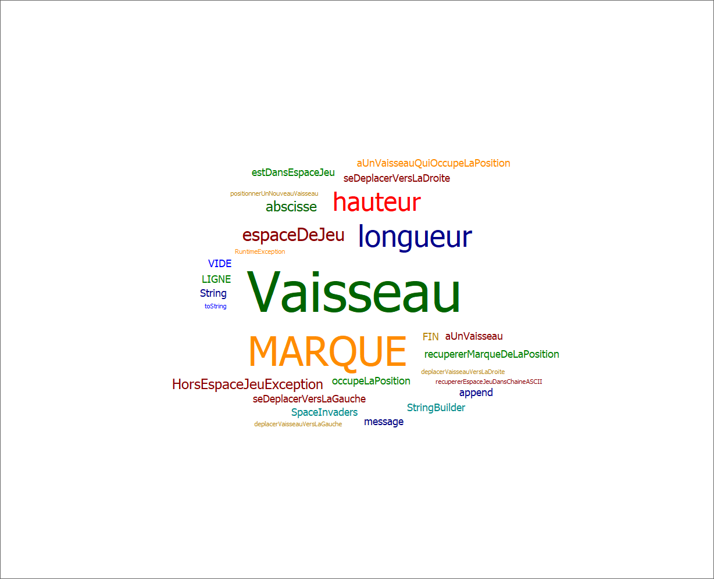

# Space invaders
- [Semaine 1 : 30/03/2020 - 05/04/2020](#semaine1) 

## Semaine 1 
### Fonctinnalité 1 : Déplacer vaisseau dans espace de jeu
#### Story 1 : 
##### Mise en place du projet
- Création du projet maven
- Création des premiers tests

*Quelsques difficultés pour synchroniser mon projet maven a gitHub en passant seulement par Eclipse*

------------

#### Story 2 :
- Découverte du refactoring
- On continue les tests
- Premiers diagrammes de classe

------------

#### Story 3 :
Bien passé

------------

#### Story 4 :
- Génération d'un nuage de mots clés

------------

### Diagramme de classe : 

------------- 

## Glossaire 

* **Vaisseau** :  véhicule commandé par le joueur, pouvant se déplacer de droite à gauche et ayant la possibilité de lancer des missiles destinés à détruire le(s) envahisseurs.

* **Envahisseur**  :  ennemi qui apparaît à l'écran, se déplace automatiquement et qui doit être détruit par un missile lancé depuis le vaisseau du joueur.

* **Missile** :  projectile envoyé à la verticale par le vaisseau vers l'envahisseur dans le but de le détruire.

La définition des termes métiers relatifs au projet doit se trouver dans le glossaire 
Ce glossaire doit être compléter au fil des séances...

------------- 
