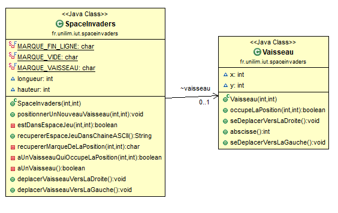
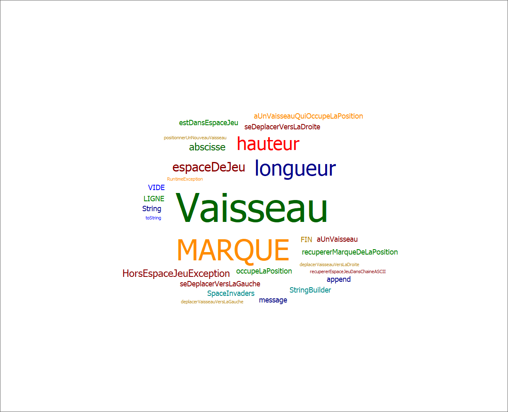
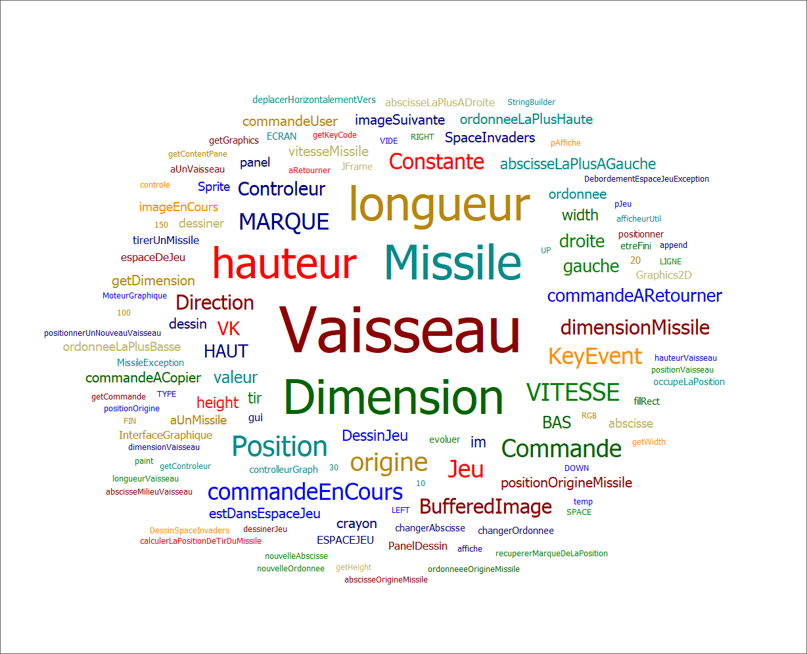
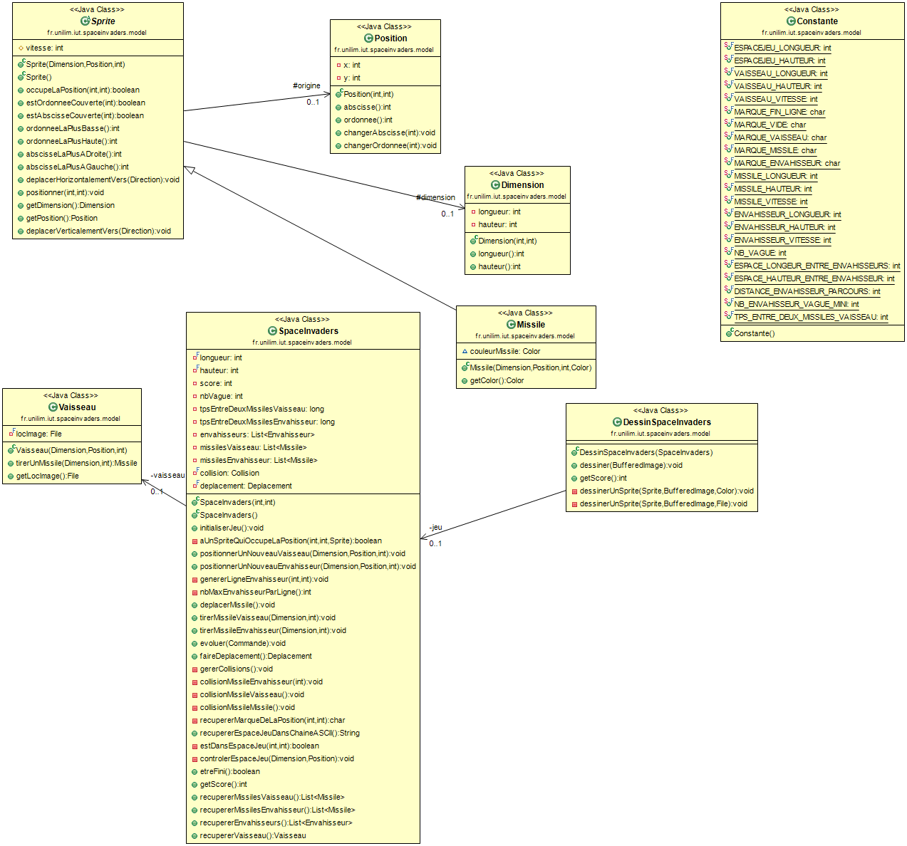
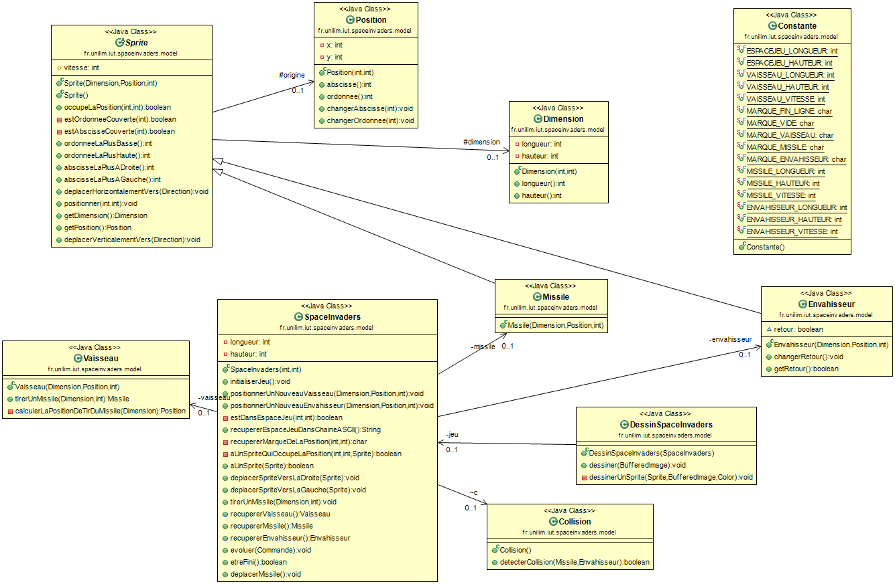
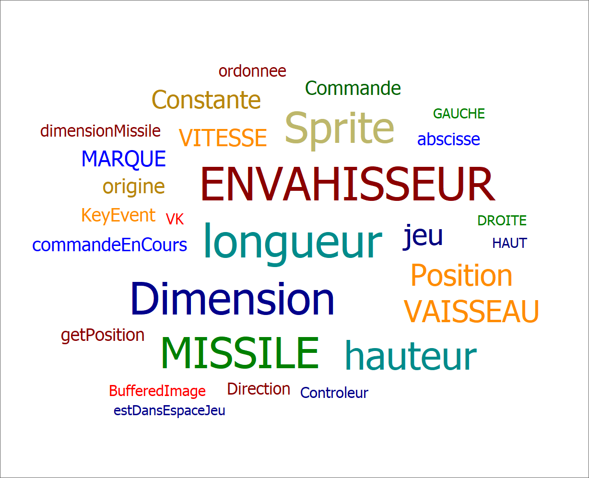
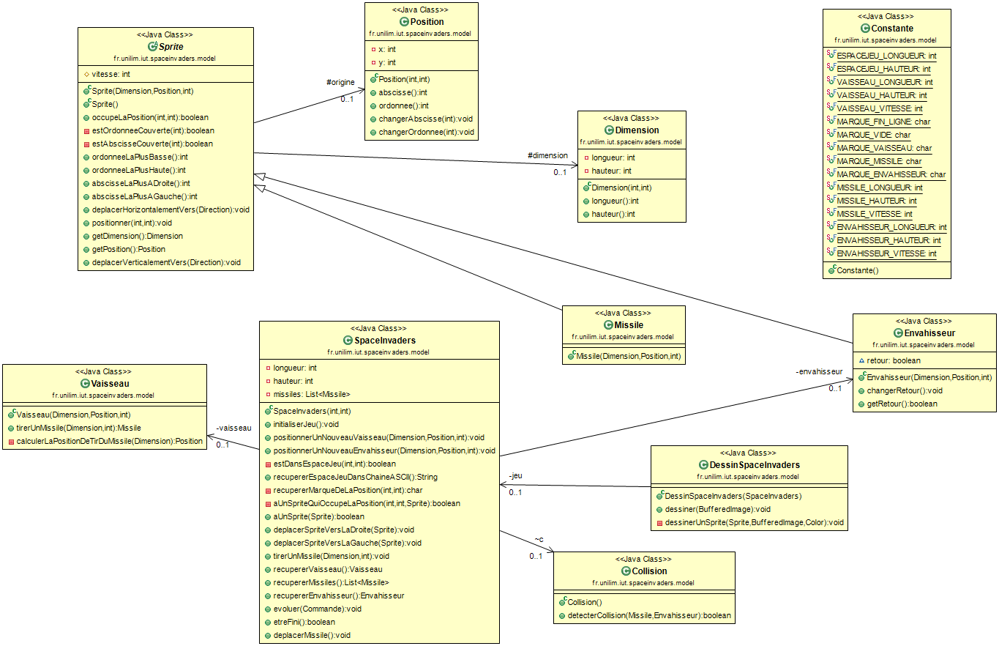
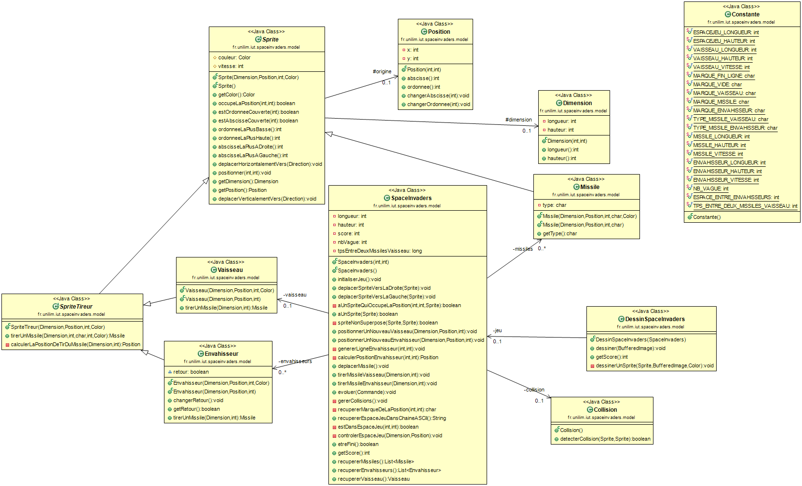
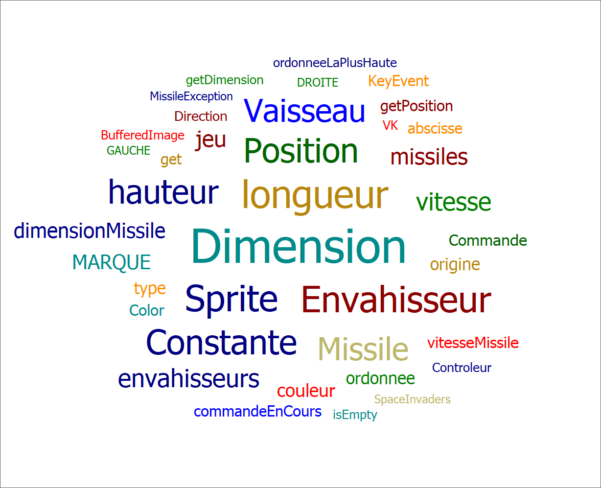

# Space invaders
- [Semaine 1](#semaine1) 
- [Semaine 2](#semaine2) 
- [Semaine 3](#semaine3) 
- [Semaine 4](#semaine4) 

Fonctionalité 13 :x:

- [Glossaire](#glossaire) 

## Semaine 1 
### Fonctinnalité 1 : Déplacer vaisseau dans espace de jeu :heavy_check_mark:
#### Story n°1 : Créer un espace de jeu 
#### Story n°2 : Positionner un nouveau vaisseau dans l'espace de jeu 
#### Story n°3 : Déplacer le vaisseau vers la droite dans l'espace de jeu 
#### Story n°4 : Déplacer le vaisseau vers la gauche dans l'espace de jeu 

### Fonctionnalité n°2 : Dimensionner le vaiseau :heavy_check_mark:
#### Etape n°1 : Positionner un nouveau vaisseau avec une dimension donnée 
#### Etape n°2 : Faire en sorte qu'il soit impossible de positionner un nouveau vaisseau qui déborde de l'espace de jeu 
#### Etape n°3 : Déplacer un vaisseau vers la droite en tenant compte de sa dimension 
#### Etape n°4 : Déplacer un vaisseau vers la gauche en tenant compte de sa dimension 
#### Refactoring

### Fonctionnalité n°3 : Choisir la vitesse du vaisseau :heavy_check_mark:

### :information_source: Diagramme de classe et nuage de mot:
#### (Fonctionnalité 1)

------------- 

## Semaine 2 
### Fonctionnalité n°4: Tirer un missile depuis le vaisseau :heavy_check_mark:
### Fonctionnalité n°5: Ajouter un envahisseur dans le jeu :heavy_check_mark:

### :information_source: Diagramme de classe et nuage de mot:
#### (Fonctionnalité 4)

#### (Fonctionnalité 5)

------------- 

## Semaine 3 
### Fonctionnalité n°6: Détecter une collision entre deux sprites :heavy_check_mark:
### Fonctionnalité n°7: Terminer la partie :heavy_check_mark:

### :information_source: Diagramme de classe et nuage de mot:
#### (Fonctionnalité 6)

------------- 

## Semaine 4 
### Fonctionnalité n°8 : Permettre au vaisseau de tirer plusieurs missiles :heavy_check_mark:
### Fonctionnalité n°9 : Envoyer une ligne d'envahisseurs :heavy_check_mark:
### Fonctionnalité n°10 : Gérer un score :heavy_check_mark:
### Fonctionnalité n°11 : Tirer un missile depuis un envahisseur de manière aléatoire :heavy_check_mark:
### Fonctionnalité n°12 : Envoyer une horde d'envahisseurs :heavy_check_mark:

### :information_source: Diagramme de classe et nuage de mot:
#### (Fonctionnalité 8)

#### (Fonctionnalité 12)

------------- 

## Glossaire 

:airplane: * **Vaisseau** : Véhicule héritant de spriteTireur. Il est controlé par le joueur et peut tirer des missiles.

:rocket: * **Missile Vaisseau** : Objet partant du vaisseau, pouvant détruire un envahisseur ou un missile de l'envahisseur lors de la collision.

:rocket: * **Missile Envahisseur** : Objet partant de l'envahisseur, pouvant détruire le vaisseau et faire perdre la partie. 

:space_invader: * **Envahisseur** : Ennemi tirant des missiles. Le but est de les détruires pour gagner le jeu. 

:dash: * **Vitesse** : Unité pour accelerer le deplacement des objets de type sprite. 

:boom: * **Collision** : Action lors de la rencontre de deux sprite.

* **Sprite** : Tout objet visible sur le terrain de jeu.

* **Sprite Tireur** : Hérite de sprite mais a la capacité de tirer des missiles.

------------- 
